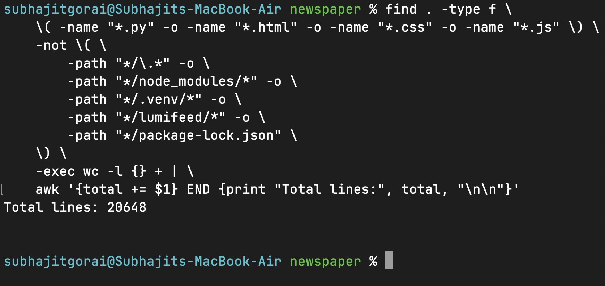
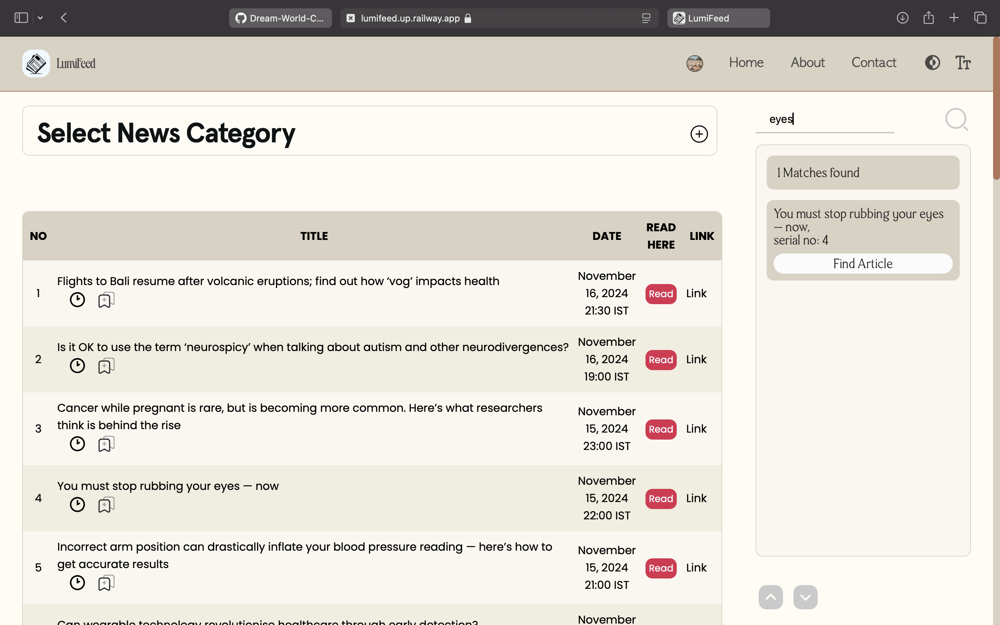
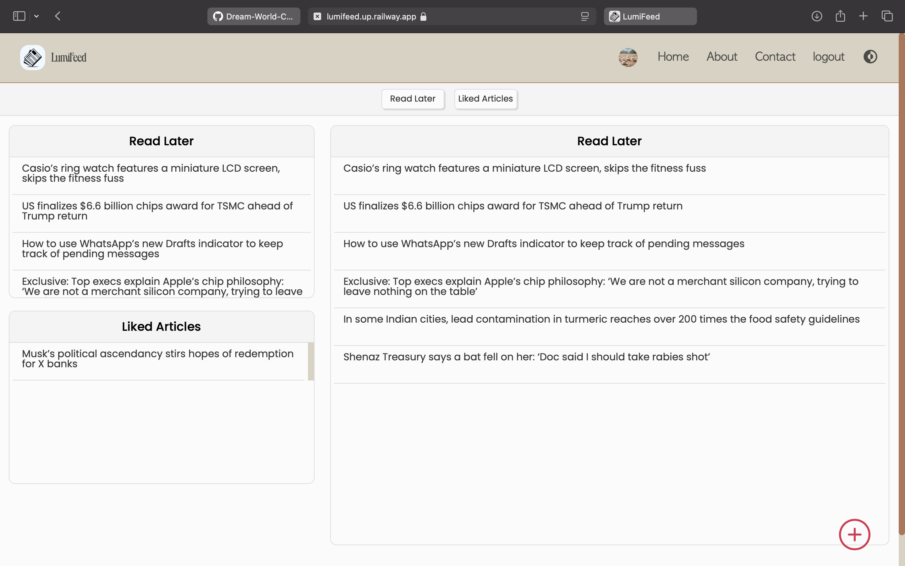
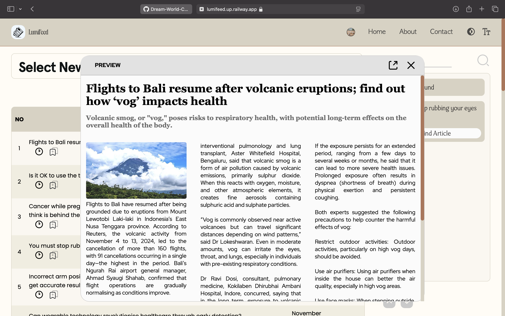
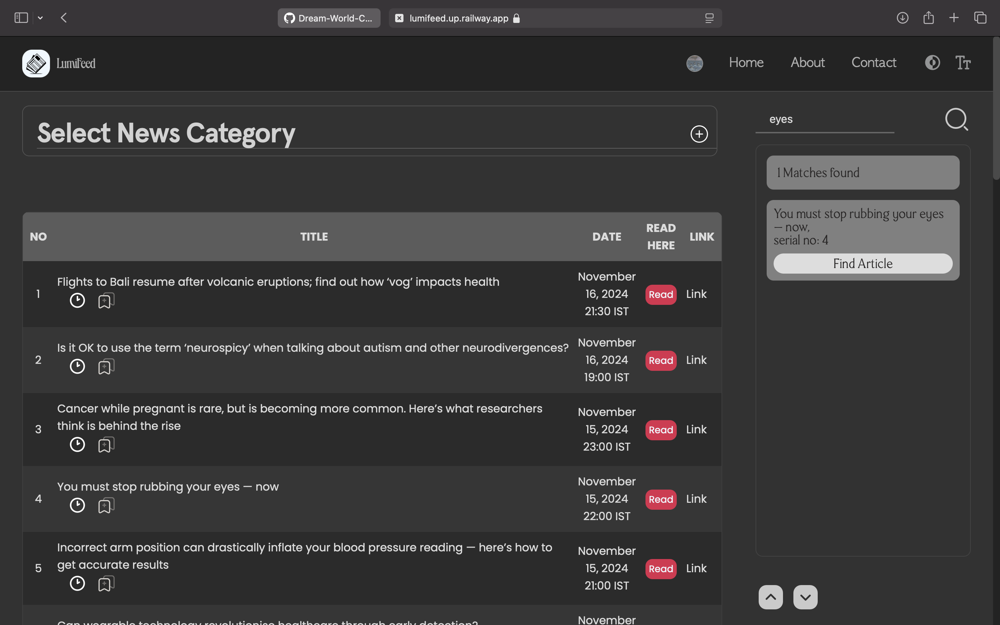
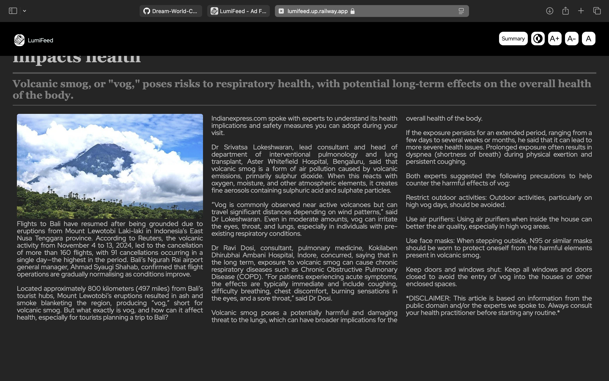

# LumiFeed

### Ad-Free News Platform with Summaries & Key Points, Delightful clutterless ui

**LumiFeed** is an ad-free news platform that delivers the latest news with a clean, clutter-free user experience. It provides quick summaries of articles to help you stay informed without the noise. News is delivered from multiple sources, with a focus on user experience.

all development up until now done by [Dream World Coder](https://github.com/Dream-World-Coder), 20000+ Lines of code.



____Interested peeps are heartily welcome to contribute____

## Why LumiFeed?

## Features

- **Ad-Free Browsing**: Enjoy news articles without the interruption of advertisements. Stay focused while reading
- **Clean UI/UX**: A simple and intuitive interface designed to prioritize user comfort.
- **Collections to Store Articles**: Collections like `Read Later` and `Liked Articles` for easy organization, also you can create custom collections of your own.
- **Quick Summaries**: Each news article is summarized into key points for quick consumption.
- **City-Specific News**: Get personalized news updates by selecting your city of interest.
- **Kolkata & Indian News**: Special coverage for Kolkata and other Indian cities.
- **Single Page Application (SPA)**: Using Ajax for a seamless experience, all interactions happen on a single page.
- **Responsive Design**: Fully responsive, works smoothly across all devices.
- **Dark Mode**: A optimised dark mode for 'night-owls'.

## In Progress

- **News Summary**: Short summary for each news article Using Google Pegasus and BERT

## Tech Stack

- **Backend**: Flask (Python) + Gunicorn
- **Frontend**: HTML, CSS (with Scss), JavaScript, jQuery
- **Database**: SQLite + PostgreSQL
- **Other Tools**:
  - Flask-SQLAlchemy
  - Ajax for dynamic content loading
  - LocalStorage for client-side caching

## Tech Concepts Used

- Backend development in Python using Flask and Gunicorn, Login, Registration, Email Verification etc
- RDBMS, M:N Relationships, Joining tables, Application of ORMs like flask-sqlalchemy
- Frontend:  javascript optimisation and fetch api for ajax, choosing fitting color pallates, layouting

## Installation

```bash
# Clone the repository
git clone https://github.com/Dream-World-Coder/LumiFeed.git
cd lumifeed

# Create and activate a virtual environment
python -m venv venv
source venv/bin/activate  # For Windows: venv\Scripts\activate

# Install dependencies
pip install -r requirements.txt

# Run the app
flask run or python run.py
```


## API Routes

```bash
Map([<Rule '/static/<filename>' (GET, HEAD, OPTIONS) -> static>,
 <Rule '/verify-email' (GET, HEAD, OPTIONS) -> verify_email>,
 <Rule '/verify' (GET, HEAD, OPTIONS) -> verify>,
 <Rule '/resend-verification-email' (OPTIONS, POST) -> resend>,
 <Rule '/register' (GET, HEAD, POST, OPTIONS) -> register>,
 <Rule '/login' (GET, HEAD, POST, OPTIONS) -> login>,
 <Rule '/logout' (GET, HEAD, OPTIONS) -> logout>,
 <Rule '/delete_account' (GET, HEAD, POST, OPTIONS) -> delete_account>,
 <Rule '/forgot_password' (GET, HEAD, POST, OPTIONS) -> forgot_password>,
 <Rule '/reset_password' (GET, HEAD, POST, OPTIONS) -> reset_password>,
 <Rule '/add_new_collection' (OPTIONS, POST) -> add_new_collection>,
 <Rule '/delete_collection' (OPTIONS, POST) -> delete_collection>,
 <Rule '/share-collection/<username>/<collection_name>' (GET, HEAD, OPTIONS) -> share_collection>,
 <Rule '/fetchnews' (GET, HEAD, OPTIONS) -> fetchnews>,
 <Rule '/home' (GET, HEAD, OPTIONS) -> index>,
 <Rule '/' (GET, HEAD, OPTIONS) -> index>,
 <Rule '/about' (GET, HEAD, OPTIONS) -> about>,
 <Rule '/contact' (GET, HEAD, OPTIONS) -> contact>,
 <Rule '/profile/<username>' (GET, HEAD, OPTIONS) -> profile>,
 <Rule '/home/<any_path>' (GET, HEAD, OPTIONS) -> anything>,
 <Rule '/<any_path>' (GET, HEAD, OPTIONS) -> anything>,
 <Rule '/db_create_all_123_lorem' (GET, HEAD, OPTIONS) -> create_tables>,
 <Rule '/read_news_here' (OPTIONS, POST) -> read_news_here>,
 <Rule '/article/<article_heading>' (OPTIONS, POST) -> read_news_in_new_tab>,
 <Rule '/remove_article' (OPTIONS, POST) -> remove_article>,
 <Rule '/add_to_read_later' (OPTIONS, POST) -> add_to_read_later>,
 <Rule '/add_to_different_collections' (OPTIONS, POST) -> add_to_different_collections>,
 <Rule '/search_in_title' (OPTIONS, POST) -> search_in_title>,
 <Rule '/make_summary' (OPTIONS, POST) -> make_summary>])

```

## Screenshots

**HOME PAGE** 

---
**PROFILE PAGE**

---
**PREVIEW NEWS ARTICLES**

---
**READ NEWS ARTICLES**

---

**DARK MODE**




## Future Features

- **User Customization**: Allow users to customize the type of news they want to see on their feed.

## Contributing

Feel free to open an issue or submit a pull request if you'd like to contribute to LumiFeed. All contributions are welcome!

## License

This project is licensed under the GNU_GPLv3.

---

### Developer

- **Subhajit Gorai** - All development, UI/UX design, and backend logic were done by me!
