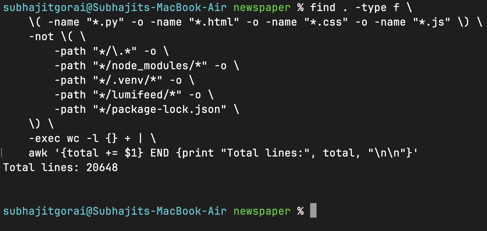

# LumiFeed

### Ad-Free News Platform with Summaries & Key Points, clutterless ui

**LumiFeed** is an ad-free news platform that delivers the latest news with a clean, clutter-free user experience. It provides quick summaries of articles to help you stay informed without the noise. News is delivered from multiple sources, with a focus on user experience.

all development up until now done by [Dream World Coder](https://github.com/Dream-World-Coder), 20000+ Lines of code.



____Interested peeps are heartily welcome to contribute____

## Why LumiFeed?

## Features

- **Ad-Free Browsing**: Enjoy news articles without the interruption of advertisements. Stay focused while reading
- **Clean UI/UX**: A simple and intuitive interface designed to prioritize user comfort.
- **Collections to Store Articles**: Collections like `Read Later` and `Liked Articles` for easy organization, also you can create custom collections of your own.
- **Quick Summaries**: Each news article is summarized into key points for quick consumption.
- **Single Page Application (SPA)**: Using Ajax for a seamless experience, all interactions happen on a single page.
- **Responsive Design**: Fully responsive, works smoothly across all devices.
- **Dark Mode**: A optimised dark mode for 'night-owls'.

## In Progress

- **News Summary**: Short summary for each news article Using Google Pegasus and BERT

## Tech Stack

- **Backend**: N/A now | Flask (Python), Gunicorn
- **Frontend**: React (jsx), Dexie, Tailwind
- **Database**: N/A now | SQLite + PostgreSQL
- **Other Tools**:
  - N/A now 
  - Flask-SQLAlchemy
  - Ajax for dynamic content loading


## Installation

```bash
# Clone the repository
git clone https://github.com/Dream-World-Coder/LumiFeed.git
cd lumifeed/frontend
pnpm i
pnpm dev

--- N/A ---

# Create and activate a virtual environment
# python -m venv venv
# source venv/bin/activate  # For Windows: venv\Scripts\activate

# Install dependencies
# pip install -r requirements.txt

# Run the app
# flask run or python run.py
```


## Contributing

Feel free to open an issue or submit a pull request if you'd like to contribute to LumiFeed. All contributions are welcome!

## License

This project is licensed under the MIT License.

